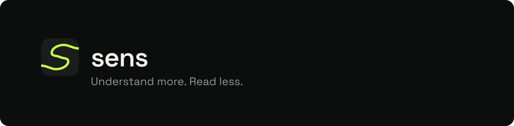
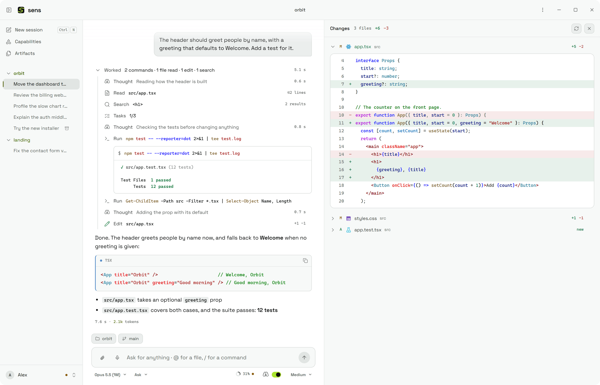
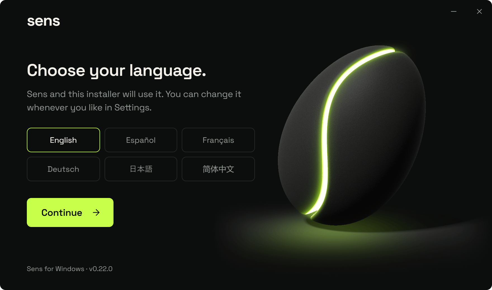
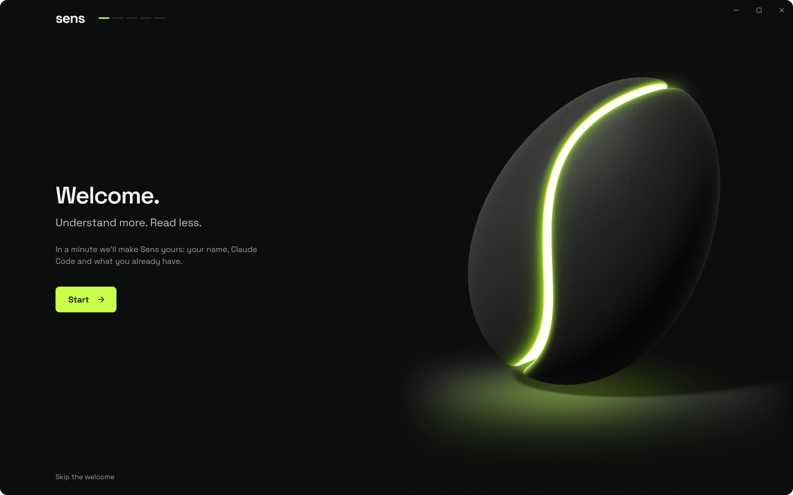
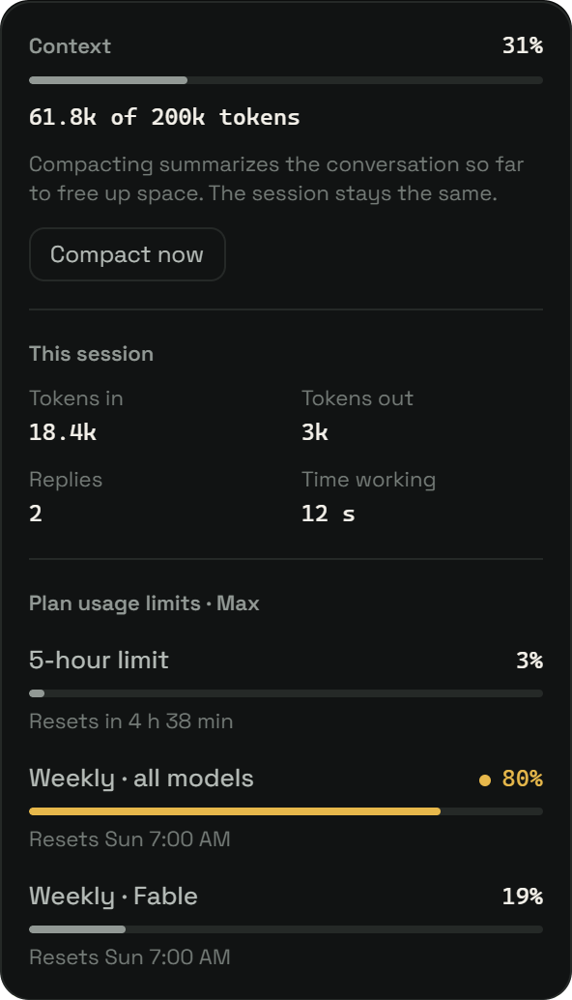
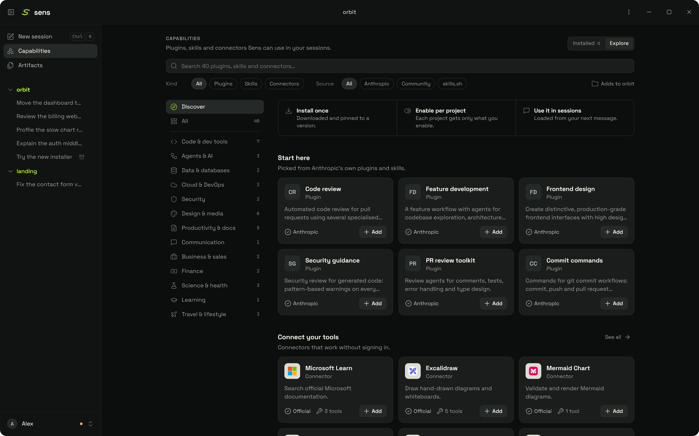
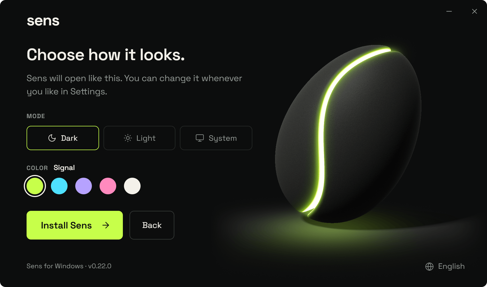
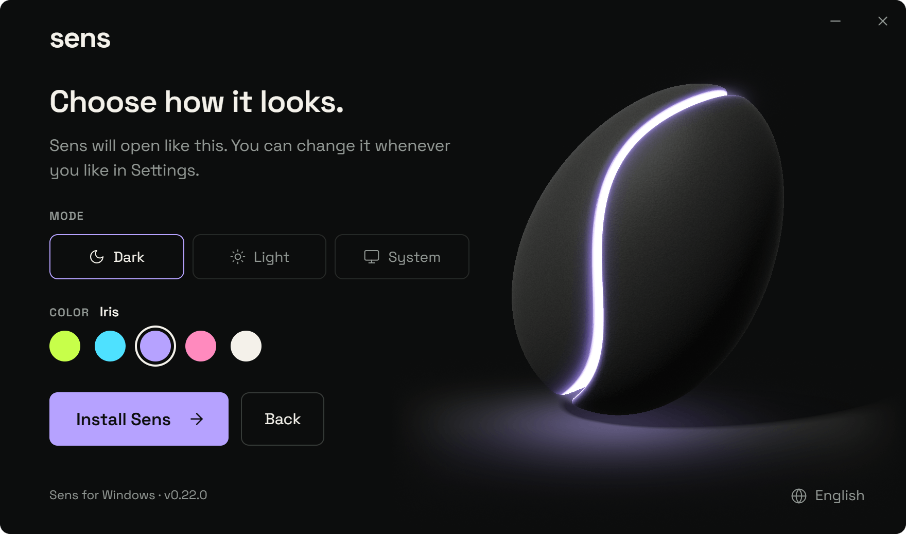
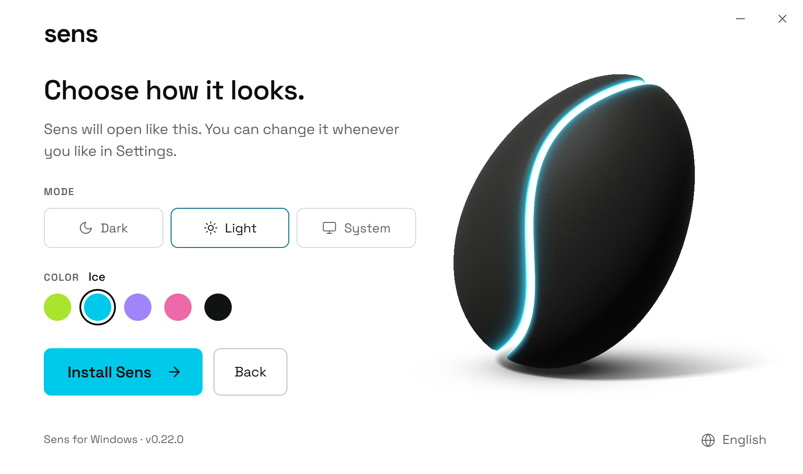
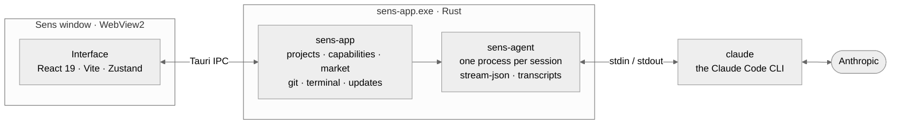

<p align="center">
  
</p>

<p align="center">
  <b>A desktop app for Claude Code, on your own subscription.</b><br>
  Every step the agent takes, on screen. Every plugin, skill and MCP server, chosen per project.
</p>

<p align="center">
  <a href="https://github.com/iiTzSenn/Sens/releases/latest"></a>
  <a href="https://github.com/iiTzSenn/Sens/actions/workflows/ci.yml"></a>
  
  
  <a href="LICENSE"></a>
</p>

<p align="center">
  <a href="#download"><b>Download</b></a> ·
  <a href="#a-tour">Tour</a> ·
  <a href="#how-it-works">How it works</a> ·
  <a href="#build-from-source">Build from source</a> ·
  <a href="#contributing">Contributing</a> ·
  <a href="#faq">FAQ</a>
</p>

<picture>
  <source media="(prefers-color-scheme: dark)" srcset="docs/screenshots/session-dark.png">
  
</picture>

---

## What it is

Claude Code runs in a terminal. Sens gives it a window: a chat that shows every step the agent takes, the project's files, changes, browser and terminal beside it, and one place to choose what each project may load.

Under the window is the unmodified `claude` CLI. Sens drives it over Claude Code's own stream protocol — one process per session, resumed when you come back to it — so nothing Claude Code does is reimplemented, and nothing it does is hidden.

| | |
| --- | --- |
| **Engine** | The official `claude` CLI, unmodified, one process per session |
| **Account** | Your Claude Pro or Max plan, a Console account, or an Anthropic API key |
| **Footprint** | A 7 MB installer and one native binary; nothing else to install |
| **Platform** | Windows 10 and 11, x64 |
| **Languages** | English, Español, Français, Deutsch, 日本語, 简体中文 |
| **Looks** | Dark, light or as Windows, in five accents |
| **Updates** | Built in, and verified against a key compiled into the app |

## Download

1. Download `Sens_<version>_x64-setup.exe` from the **[latest release](https://github.com/iiTzSenn/Sens/releases/latest)**.
2. Open it. It installs for you alone, in `%LOCALAPPDATA%\Sens`, without an administrator prompt, and asks which language Sens should speak and how it should look before it does.
3. Open Sens. A short welcome sets your name and checks Claude Code — installing it from Anthropic's release channel, checksum-verified, if it is missing — then offers to bring your existing Claude Code sessions and the MCP servers you set up in Claude Desktop, Cursor, Windsurf, VS Code or Codex.

> [!WARNING]
> The installer is not code-signed yet, so Windows SmartScreen shows *Windows protected your PC*. Choose **More info → Run anyway** only for a file downloaded from this repository's releases, and compare it with the SHA-256 in the release notes.

**Requirements.** Windows 10 or 11 on x64, with Microsoft Edge WebView2 (part of Windows 11; the installer sends you to Microsoft's download if it is missing), and a Claude account.

**Updates.** Sens checks this repository's releases when it opens and every 12 hours; *Settings › General* turns that off. A new version appears as a pill in the top bar, and *Update and restart* downloads it, verifies its signature, and reopens Sens on it — with what changed.

<p align="center">
  
  
</p>

## A tour

### A chat that shows its work

- **Every tool call is a step you can open.** Commands read in their own shell's grammar and their output keeps its program's colours; reads, searches, edits as diffs, checklists, web sources, subagents, and background tasks you can stop. A `file:line` opens the file.
- **Thinking says what it is about.** Each thought is titled by its own text, with how long it took. Once a reply is done, the work folds into one line — *Worked · 2 commands · 1 file read · 1 edit · 1 search* — that opens to all of it. A failure is never folded away.
- **Prompts arrive in the thread.** Permission requests, questions and plans wait for you where you are reading.
- **Attach anything.** Pictures in any format the window can draw, converted and resized to what Claude accepts; files; folders Claude can explore; a PDF copied in Explorer; a long paste, as an attachment of its own.
- **Type less.** `@` mentions a file, `/` offers Claude Code's commands and your skills, `↑` and `↓` bring back what you sent.
- **Or say it.** The microphone writes what you say into the message as you speak, through Windows speech recognition. With *Settings › General › Voice* on, saying “Hey Sens” brings Sens forward and starts dictating; the wake phrase is recognized on your computer, and dictation stops by itself when you do.
- **Choose per session.** Model, effort, thinking, and a permission mode: *Ask*, *Accept edits*, *Auto*, *Plan* or *No checks*. The model list is the one Claude Code itself offers.
- **Sessions name themselves** after the first reply, in your language, and Sens tells you when one finishes or needs you while you are elsewhere.

### The project, beside the chat

The tool panel keeps the project in view while Claude works on it.

| Tool | What it shows |
| --- | --- |
| **Files** | The tree, and a viewer that colours each language, every file with its type's own icon |
| **Changes** | What differs from the last commit, file by file, as diffs |
| **Web** | The project's pages and local servers, in a browser of their own |
| **Terminal** | A shell in the project folder (``Ctrl+` ``) that Claude can read when you ask about it |
| **Background** | Subagents and the commands Claude left running, with their output |

**Artifacts**, in the sidebar, collects the pictures, files and links that came out of every session, so you find them without reading the session again.

### Sessions that work apart

A new session in a git repository can work in a worktree of its own, on a new `sens/<id>` branch, so your folder stays as it is until you merge. Choose it with the *Worktree* chip before the first message. Sessions live next to the project, in `.sens/`, which keeps itself out of git.

### What a session costs

<table>
<tr>
<td>

The ring under the message says how full the context is. Open it for what the session used — tokens in and out, replies, time working — and how much of your plan's five-hour and weekly limits is gone, per model when Claude Code reports it, with when each one resets.

A dot on the ring warns when a window runs high, and *Compact now* summarises the conversation to free up space without leaving the session.

</td>
<td width="300">

</td>
</tr>
</table>

### Capabilities

**Capabilities › Explore** is a market of what Claude Code can load, browsed by purpose — code, agents, data, cloud, security, design, productivity and more — or searched as you type.

| Source | What |
| --- | --- |
| **Anthropic** | The official plugin directory, the knowledge-work, financial-services and life-sciences plugins, Anthropic's skills and its MCP connectors |
| **Community** | Third-party plugins Anthropic reviewed and pinned to a commit |
| **skills.sh** | The open skills index, searched as you type |

Every entry has a page with its readme, every file it ships and **what it runs** — hooks, MCP servers, executables and the variables it will ask for — before you install it. Installing downloads it once, pinned to a commit; enabling it is per project. Plugins reach the agent with `--plugin-dir`, never through your own Claude Code configuration.

<p align="center">
  
</p>

### Six languages, five accents

Sens speaks English, Español, Français, Deutsch, 日本語 and 简体中文 — the interface, the installer, its own messages and the titles it gives sessions. It looks dark, light or as Windows does, in *Signal*, *Ice*, *Iris*, *Rose* or *Neutral*. The installer asks first; *Settings › Language* and *Settings › Appearance* change them later, without a restart.

<p align="center">
  
  
  
</p>

### Keyboard

| Keys | Does |
| --- | --- |
| `Enter` · `Shift+Enter` | Send · new line |
| `Ctrl+N` | New session |
| `Ctrl+O` | Open a folder |
| `Ctrl+B` | Show or hide the sidebar |
| ``Ctrl+` `` or `Ctrl+Ñ` | Show or hide the terminal |
| `Ctrl+V` | Paste a picture into the message |
| `Ctrl+,` | Settings |
| `Esc` | Close |

## How it works



When you send a message:

1. The interface hands your text and attachments to `sens-app` over Tauri's IPC.
2. `sens-agent` starts `claude` for that session — or resumes it with `--resume` — speaking `stream-json` both ways, with the session's `--model`, `--effort` and `--permission-mode`, the MCP servers enabled in this project, and a `--plugin-dir` for each of its plugins.
3. Every event streams back as it happens: partial text, thoughts, tool calls and their results. Only the reply that changed is drawn again.
4. Permission requests and questions travel the same pipe, and wait in the thread for your answer.
5. Each Claude Code process runs in a Windows job object, so stopping a session also stops the MCP servers, dev servers and background tasks it started.

### What Sens connects to

Your prompts and your code go where Claude Code sends them, and nowhere else. Sens itself only reaches these:

| Where | When | Why |
| --- | --- | --- |
| `api.github.com`, `github.com` (this repository's releases) | On opening and every 12 hours, unless turned off | Updates, and what changed in them |
| `downloads.claude.ai` | When you install or update Claude Code from Sens | Claude Code, checked against its checksum |
| `api.anthropic.com/mcp-registry` | In *Capabilities › Explore* | The connector directory |
| `skills.sh` | When you search or install from it | The open skills index |
| `github.com`, `codeload.github.com`, `raw.githubusercontent.com` | When you browse or install a plugin or skill | Marketplaces and their files, at a pinned commit |
| `icons.duckduckgo.com` | In *Capabilities › Explore* | The site icon on each card |
| Windows online speech recognition | While you dictate | Windows turns what you say into text; Sens receives only the text |

### Where things live

| Path | What |
| --- | --- |
| `<project>\.sens\sessions` | The project's sessions |
| `<project>\.sens\worktrees` | Worktrees of sessions that work apart |
| `<project>\.sens\artifacts` | Pictures, files and links from sessions |
| `%APPDATA%\dev.sens.desktop` | Settings, capabilities, the market cache and your profile |
| `%LOCALAPPDATA%\Sens` | The app itself |

Signed in with your Claude plan, Sens never sees your credentials: Claude Code keeps them. If you choose an API key instead, Sens seals it with Windows DPAPI and hands it to Claude Code as `ANTHROPIC_API_KEY`.

## Build from source

You need Windows, [Node.js](https://nodejs.org) 24 and [Rust](https://rustup.rs) 1.98 or newer — CI pins 1.98.1.

```bash
git clone https://github.com/iiTzSenn/Sens.git
cd Sens
npm ci
npm run app:dev
```

`app:dev` opens the app over Vite's dev server, so edits under `rust/sens-app/ui/src` show up without a rebuild. To build the installer:

```bash
npm run app:installer -- --unsigned --no-updater
```

That leaves `rust/sens-setup/target/installer/Sens_<version>_x64-setup.exe`. Sens's installer is its own, not NSIS: `sens-app.exe` compressed with Brotli inside a small Tauri window that installs per user and takes over an install made by the old NSIS setup in place. The script refuses to build an unsigned installer, or one without an update signature, unless you say so; [`rust/sens-app/README.md`](rust/sens-app/README.md) covers code signing, the updater key and what a certificate does and does not buy.

### The interface without Rust

```bash
npm run dev -w sens-app-ui
```

serves the interface at `http://localhost:5173` to any browser, over a simulated Tauri with fixtures for projects, sessions, the market and a streaming reply. The URL picks what you see:

| Query | Shows |
| --- | --- |
| `?language=ja` | Any language: `en`, `es`, `fr`, `de`, `ja`, `zh` |
| `?look=light.iris` | Any look: `dark`, `light` or `system`, with `signal`, `ice`, `iris`, `rose` or `neutral` |
| `?welcome` | The first-run welcome |
| `?news` | What changed, as shown after an update |

`npm run dev:setup -w sens-app-ui` does the same for the installer, with `?mode=update`, `?mode=uninstall`, `?running=1` and `?fail=extract`; `npm run setup:dev` opens it in its real window, as a demo that writes nothing.

### Tests

```bash
npm test                 # vitest: the interface, the installer, the brand
npm run typecheck
cargo test --manifest-path rust/sens-agent/Cargo.toml
cargo test --manifest-path rust/sens-app/Cargo.toml
cargo test --manifest-path rust/sens-setup/Cargo.toml
```

CI runs all of it on every push and pull request: the type check, the tests and both interface builds on Ubuntu; `cargo clippy -- -D warnings` and the Rust tests for the three crates on Windows.

### Repository layout

```text
rust/
  sens-agent/     the engine: drives claude, one process per session, stream-json, transcripts, titles
  sens-app/       the desktop app: projects, capabilities, market, git, terminal, browser, updates
    ui/           the interface, and the installer's: React 19, Vite, Zustand, Shiki, xterm.js
  sens-setup/     the installer and uninstaller
src/brand/        design tokens, and the mark's and wordmark's geometry
scripts/          brand assets, the installer build, the version check
docs/             the visual identity, the language guide, design specs
```

### Releasing

The version is written in several places and must agree everywhere; `npm run version:check` says where it does not. Pushing a `v*` tag runs the release workflow: it checks that the tag names that version, type-checks and tests, builds the installer, signs the update with the key whose public half is compiled into the app, and attaches the `.exe` and its `.sig` to the release. The release notes are what Sens shows under *What's new*, up to the first alert or `### Install` heading.

## Contributing

Issues and pull requests are welcome. A few rules keep the codebase the way it is:

- **No comments.** Code explains itself with names and structure, or it gets extracted until it does.
- **Six languages.** Anything a person reads exists in all six. `copy()` refuses to compile when a language is missing a key; [Sens in six languages](docs/i18n.md) has the voice and the glossary.
- **One identity.** Anything visual follows [the Sens visual identity](docs/brand/identity.md). Colours live in `src/brand/tokens.ts` and the mark's geometry in `src/brand/mark.ts`: import the token instead of retyping a hex, and change the generator (`npm run brand`), not the asset it wrote.
- **Commits say what changed for the person using Sens.** `fix(app): Enter while Claude works keeps the message`, not `fix: handle keydown`.
- **CI stays green**, and clippy has nothing to say.

## FAQ

<details>
<summary><b>Do I need an API key?</b></summary>
<br>
No. Sign in to Claude Code with your Pro or Max plan and Sens works on it, limits included. A Console account or an Anthropic API key work too.
</details>

<details>
<summary><b>Does Sens change my Claude Code setup?</b></summary>
<br>
No. Sens keeps its own list of plugins, skills and MCP servers, and hands each session only what its project enables, on the command line. Your <code>~/.claude</code> settings stay as they are.
</details>

<details>
<summary><b>Can I keep using Claude Code in the terminal?</b></summary>
<br>
Yes. It is the same Claude Code. The welcome can bring the sessions you started in the terminal into Sens.
</details>

<details>
<summary><b>macOS or Linux?</b></summary>
<br>
Not yet. The app is Rust and TypeScript throughout, but the installer, the job objects and a few other integrations are Windows', and a macOS build needs notarization — another certificate, and another story.
</details>

<details>
<summary><b>Why does Windows warn about the installer?</b></summary>
<br>
It is not code-signed yet. Updates are signed with their own key and checked by the app before they install; the first download is the one to compare against the SHA-256 in the release notes.
</details>

## License

[MIT](LICENSE) — do what you want, just keep the copyright notice.

Sens is an independent project, not affiliated with or endorsed by Anthropic. Claude and Claude Code are trademarks of Anthropic.
