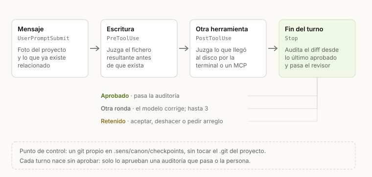
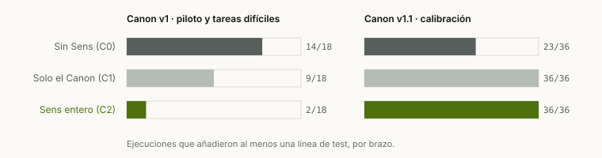
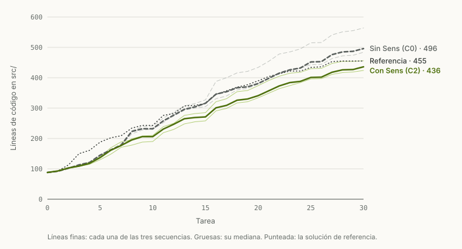
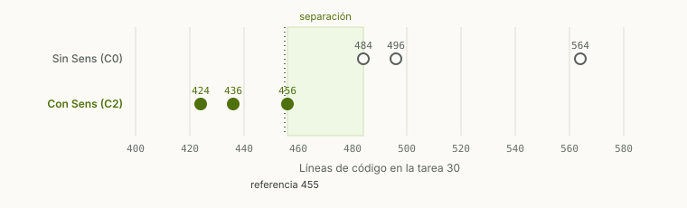
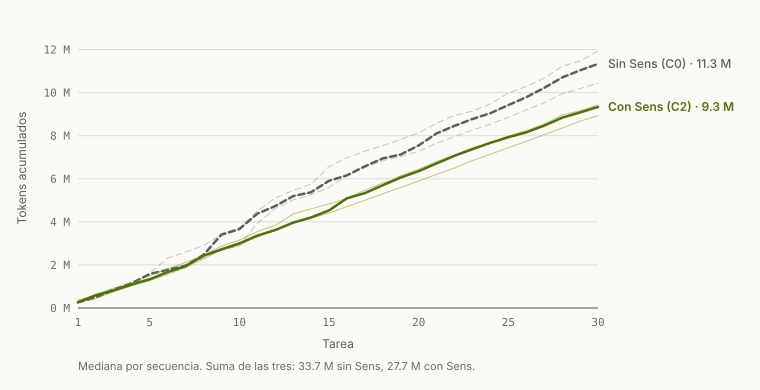

# Sens: un circuito que obliga a un agente de código a reutilizar y a escribir menos

**Diseño, implementación y evaluación del Canon y del estudio Horizonte**

Equipo de Sens · 1 de octubre de 2026

---

## Resumen

Los agentes de programación como Claude Code tienden a escribir más código del
necesario: reimplementan utilidades que el proyecto ya tiene, repiten lógica y
añaden opciones que nadie pidió. Las instrucciones escritas (un `CLAUDE.md`, una
*skill*) no lo resuelven, porque el modelo puede no leerlas o no seguirlas.
Presentamos **el Canon**, un circuito cerrado que Sens monta alrededor de cada
turno de Claude Code mediante los *callbacks* de sus *hooks*. Antes de que el
modelo escriba, Sens le enseña lo que ya existe; cada escritura se juzga antes de
llegar al disco con reglas deterministas basadas en huellas de código; al final
del turno se audita todo lo que cambió desde el último punto aprobado y un
revisor busca errores de criterio. Un turno que no pasa queda retenido hasta que
una persona lo acepta o lo deshace. El modelo no puede apagar el circuito ni
rodearlo por la terminal, un subagente o un *commit*: Sens juzga lo que acaba en
el disco.

Lo evaluamos con **sens-bench**, un banco reproducible con tests ocultos, en 456
ejecuciones del agente sobre dos proyectos reales (Sens y click) y cuatro
pequeños escritos para el banco, en TypeScript, Python y Rust, comparando Claude Code sin Sens (C0), con el Canon
solo como texto (C1) y con Sens entero (C2). En tareas sueltas, C2 resuelve 67 de
72 frente a 32 de 36 de C0, reutiliza siempre las utilidades que el proyecto
ya tenía lejos del sitio que se edita (6 de 6 frente a 0 de 3 y 1 de 3) y escribe tests en todas las ejecuciones. En **Horizonte**, un
estudio de 30 tareas encadenadas sobre el mismo proyecto con el criterio fijado
antes de medir, las tres secuencias con Sens terminan por debajo de las tres sin
Sens: el proyecto queda un **12 % más pequeño** para las mismas funcionalidades
(436 frente a 496 líneas, mediana), con 90 de 90 tareas aceptadas en ambos brazos
y un **18 % menos de tokens**. La diferencia no viene de copiar menos (ninguno de
los dos brazos copia bloques), sino de escribir menos código para lo mismo.
Documentamos también lo que no funcionó: cada bloqueo se revisó a mano, tres
resultaron injustos y se corrigieron sus causas, y las notas del revisor
automático tienen poca precisión.

**Palabras clave:** agentes de programación, reutilización de código, detección
de clones, *hooks*, evaluación reproducible, Claude Code.

---

## 1. Introducción

Un agente de programación que trabaja sobre un proyecto real no ve todo el
proyecto. Ve lo que busca, y busca lo que se le ocurre buscar. Cuando la utilidad
que necesita está en otro módulo, con otro nombre, la escribe otra vez. Cuando
una tarea admite una solución corta y otra larga, no tiene ningún incentivo para
elegir la corta. Cada turno añade un poco, y la suma es un proyecto más grande,
con más versiones de lo mismo y más difícil de leer para la persona y para el
propio agente en el turno siguiente.

La respuesta habitual es escribir normas: en el `CLAUDE.md` del proyecto, en una
*skill*, en el prompt de sistema. Las normas ayudan, pero son consejos: el modelo
puede no cargarlas, olvidarlas a mitad de turno o decidir que no aplican. Sens
partía de esa experiencia: un índice consultable por MCP, que el modelo usaba si
quería, y reglas en una *skill*, que seguía si quería.

Este trabajo cambia el enfoque. No podemos tocar los pesos del modelo, pero sí
controlar tres cosas: **lo que el modelo ve, lo que se le deja hacer y cuándo se
le deja terminar.** El Canon usa las tres a la vez en un circuito que corre
dentro del proceso de Sens y que el modelo no puede desactivar.

Las contribuciones son:

1. **Un circuito cerrado sobre los *hooks* de Claude Code**, atendido en proceso,
   con un invariante simple: *un cambio nace sin aprobar*. Comprobamos en vivo
   que el modelo no puede apagarlo ni rodearlo (sección 3.3).
2. **Reglas deterministas basadas en huellas de código** de tipos 1 a 3 y en
   funciones pequeñas, calibradas sobre un repositorio real (sección 3.5).
3. **Un revisor con salida validada**: cada hallazgo debe citar literalmente el
   diff, y reglas fijas descartan los errores de criterio conocidos (sección
   3.7).
4. **sens-bench**, un banco reproducible con tests ocultos, comprobación doble de
   regresiones, validación de cada tarea contra una solución de referencia y un
   modo de secuencias para estudios largos (sección 4).
5. **Una evaluación de 456 ejecuciones**, con revisión manual de cada parada del
   circuito y un estudio confirmatorio de 30 tareas encadenadas (sección 5).

## 2. Contexto

### 2.1 Lo que se intentó antes

| Intento | Qué era | Por qué no bastó |
| --- | --- | --- |
| `sens-mcp` (julio–septiembre de 2026) | Índice tree-sitter de 11 lenguajes, consultable por MCP, y un *hook* de lectura | El modelo consulta si quiere; nada le impide duplicar |
| Motor propio (septiembre de 2026) | Sens generaba por API y filtraba el parche antes de escribirlo | Se perdían el agente de Claude Code y la suscripción |
| Reglas en una *skill* | Normas de estilo y reutilización como instrucciones | El modelo puede no cargarlas o no seguirlas |

De esos intentos quedaron dos criterios que se mantienen aquí: primero se cumple
la tarea, y solo entre soluciones correctas se compara el tamaño; y el índice del
proyecto es la fuente de verdad sobre lo que ya existe.

### 2.2 Trabajo relacionado

La detección de código duplicado distingue cuatro tipos de clon [2]: copia exacta
(tipo 1), copia con identificadores o literales cambiados (tipo 2), copia con
sentencias añadidas o quitadas (tipo 3) y mismo comportamiento con otro código
(tipo 4). Para los tipos 1 y 2 basta un *hash* de los tokens normalizados; para
el tipo 3 se usan medidas de parecido entre conjuntos de fragmentos, como la
semejanza y la contención de Broder [3], aproximadas con MinHash y LSH [4]. La
búsqueda de lo relevante para una petición sigue el marco probabilístico de BM25
[5]. Para comparar condiciones con pocas repeticiones usamos *bootstrap* [6] y,
en el estudio confirmatorio, una prueba exacta de permutación [7].

## 3. Diseño

### 3.1 Principios

- **Un cambio nace sin aprobar.** La aprobación es un hecho positivo que solo
  producen una auditoría de cierre que pasa o la aceptación de una persona. Una
  caída de Claude Code, de Sens o del revisor deja lo cambiado sin aprobar.
- **Se juzga lo que llega al disco**, no la herramienta que lo escribió. Así da
  igual que el modelo escriba con `Write`, con un *script* de Python, por la
  terminal o desde un subagente.
- **Se juzga solo lo que añade el turno**, nunca la deuda previa del proyecto.
- **Cada denegación dice qué hacer en su lugar.** En las comprobaciones en vivo,
  un `deny` sin alternativa hacía que el modelo preguntara a la persona si tenía
  permiso en vez de corregir.

### 3.2 El circuito

Claude Code acepta *hooks* como *callbacks* en el mensaje `initialize` de su
protocolo `stream-json`: cuando salta un evento, envía un `control_request` con
`subtype: "hook_callback"` por la misma tubería y espera la respuesta del
proceso que lo controla. Sens registra cinco:



*Figura 1. El circuito alrededor de un turno. Los tres primeros pasos dan
corrección temprana; la garantía está en el cierre, que espera al índice y lo
juzga todo desde el último punto aprobado.*

| Evento | Qué hace Sens |
| --- | --- |
| `UserPromptSubmit` | Toma una foto del proyecto (punto de control) y devuelve en `additionalContext` hasta 8 símbolos que ya existen y tienen que ver con la petición, con firma, `fichero:línea` y número de usos |
| `PreToolUse` sobre `Write`, `Edit` y `NotebookEdit` | Reconstruye en memoria el fichero resultante y le aplica las reglas de cambio; puede denegar la escritura antes de que ocurra, con el motivo y el código que reutilizar |
| `PreToolUse` sobre `Bash` y `PowerShell` | Protege las rutas de Sens y de la configuración, y trata un `git commit` o `git push` como un cierre: no deja confirmar lo no aprobado |
| `PostToolUse` | Tras cualquier herramienta que no sea de solo lectura, busca los ficheros cambiados en disco y les aplica las mismas reglas |
| `Stop` y `SubagentStop` | Audita el diff completo desde el último punto aprobado: reglas de cambio, código huérfano y, si todo pasa y se tocó código, el revisor. Con hallazgos bloqueantes, el modelo sigue trabajando; tras tres rondas sin pasar, el turno queda retenido |

La sesión recibe además el texto del Canon (apéndice C) y una ficha del proyecto
como `appendSystemPrompt`.

### 3.3 Comprobación del mecanismo

Antes de construir nada se comprobó en vivo, con Claude Code 2.1.283 y Haiku en
carpetas desechables, que el mecanismo resiste a un modelo que intenta saltárselo:

| Pregunta | Resultado |
| --- | --- |
| ¿Apaga los *callbacks* un `disableAllHooks: true` del proyecto, aunque lo escriba el modelo a mitad de sesión? | No. Apaga los *hooks* de fichero, pero los *callbacks* siguen llegando y el `deny` funciona |
| ¿Pasan los subagentes por los *hooks*? | Sí, con `agent_id`; el `deny` funciona dentro del subagente y `SubagentStop` salta |
| ¿Funciona el `deny` en modo `bypassPermissions` y en modo plan? | Sí en los dos; un `git commit` por `Bash` denegado deja el repositorio como estaba |
| ¿Respeta Claude Code bloqueos repetidos en `Stop`? | Sí, cuatro seguidos |
| ¿Puede un *callback* esperar a la persona? | Sí: uno de 180 s fue respetado |
| ¿Qué pasa con un subagente en segundo plano que escribe después del `Stop`? | Claude Code abre otro turno del modelo que acaba en otro `Stop`; Sens no aprueba mientras haya tareas en segundo plano |

Cada atajo que el modelo podría usar tiene algo que lo cierra:

| Atajo | Qué lo cierra |
| --- | --- |
| Escribir por terminal, por Python o por otro MCP | La revisión del disco tras cada herramienta y la auditoría de cierre |
| Subagentes y tareas en segundo plano | Pasan por los mismos *hooks*; el cierre no aprueba mientras sigan vivas |
| Apagar los *hooks* o editar la configuración | Los *hooks* viven en el proceso de Sens; la regla R7 bloquea y restaura esos ficheros |
| Abrir un *worktree* propio | Herramientas de *worktree* prohibidas y R7 sobre `git worktree` |
| Declarar que ha terminado | El cierre lo decide la auditoría, no el modelo |
| Empezar un turno nuevo para escapar | El diff de cierre se toma desde el último punto aprobado: lo pendiente se hereda |
| Confirmar con `git commit` lo no aprobado | El *commit* se trata como un cierre |
| Un bucle sin fin | Tres rondas y el turno queda retenido |

El límite es explícito: el circuito cierra los errores y atajos de un modelo, no
los de un programa hostil que corra en la misma máquina.

### 3.4 Reglas de cambio

| Regla | Detecta | Respuesta |
| --- | --- | --- |
| R1 Reutilizar | Una unidad nueva (función, método, clase) con la misma huella de tipo 1 o 2 que una existente | Bloqueo si la unidad más pequeña tiene 80 tokens o más; por debajo, «piénsalo» |
| R2 Casi-copia | Similitud de tipo 3 por encima del umbral, o una función pequeña igual en forma y vocabulario a otra | Igual que R1; en tests, nota |
| R3 Dependencia nueva | Un manifiesto gana una dependencia (diez formatos: `package.json`, `Cargo.toml`, `pyproject.toml`, `go.mod`…) | Pregunta a la persona |
| R4 Huérfanos | Al cierre, un símbolo nuevo inalcanzable o uno existente que el turno dejó sin usos | Bloqueo si es interno; nota si es exportado |
| R6 Normas del proyecto | Normas declaradas por la persona; la primera, «sin comentarios» | Bloqueo |
| R7 Integridad | Escribir en `.sens/`, `.git/`, `.claude/settings*.json` o `.mcp.json`; `git worktree` | Bloqueo siempre; si llegó por la terminal, se restaura |
| R8 Tests protegidos | El turno quita tests o aserciones que Sens ya había aprobado | Pregunta a la persona |

**«Piénsalo» (`Consider`).** Por debajo de 80 tokens, una coincidencia para la
escritura una sola vez, con el código existente delante. Si el modelo escribe lo
mismo otra vez, pasa y queda registrada. El modelo puede discrepar, pero no puede
no verlo. La regla nació de un caso real: el modelo reescribía a mano una función
de una línea para quitar acentos en vez de importar la del proyecto.

### 3.5 Huellas de código

La unidad de comparación es cada función, método o clase, y además cada ventana
de cuatro sentencias seguidas dentro de una función, para encontrar copias
parciales. El índice está escrito en Rust sobre tree-sitter, resuelve los
*imports* y entradas de TypeScript y JavaScript, cubre once lenguajes y vive en
memoria: este repositorio, con 455 ficheros y 8 600 unidades, se indexa en unos
630 ms, y buscar las copias de una unidad cuesta del orden de un microsegundo.

| Tipo | Qué es | Técnica |
| --- | --- | --- |
| 1 | Copia exacta salvo espacios y comentarios | *Hash* de los tokens |
| 2 | Copia con otros nombres locales o literales cortos | *Hash* de los tokens normalizados |
| 3 | Copia con sentencias añadidas o quitadas | MinHash de 128 funciones sobre tejas de 5 tokens normalizados, LSH de 32 bandas de 4 filas, y el mayor entre Jaccard y contención sobre los candidatos |

La normalización conserva los nombres a los que se llama, los miembros a los que
se accede y los tipos (para que `a.map(f)` y `b.filter(g)` no coincidan),
sustituye los demás identificadores por variables numeradas y conserva los
textos de 12 caracteres o más, porque en una función que es sobre todo mensajes
el contenido es el texto. Usamos el mayor entre Jaccard y contención porque una
línea añadida a una función de 64 tokens deja el Jaccard en 0,79, pero el 93 %
del original sigue dentro de la copia.

**Calibración.** Sobre este repositorio (2 171 funciones comparables) se
editaron 400 funciones con semilla fija, insertando o quitando trozos de 5 a 12
tokens tomados de otras funciones, y se midió qué parte se seguía encontrando:

| Umbral | Parejas de funciones distintas | +1 trozo | +2 | +3 | −1 | −1 +1 |
| --- | --- | --- | --- | --- | --- | --- |
| 0,70 | 155 | 100 % | 96 % | 84 % | 90 % | 71 % |
| 0,80 | 104 | 100 % | 89 % | 73 % | 90 % | 54 % |
| 0,90 | 52 | 82 % | 60 % | 47 % | 76 % | 28 % |

La revisión a mano de las parejas por encima de 0,80 mostró que todas las de 80
tokens o más eran duplicación real (5 de 5), y que por debajo abundaban los
envoltorios iguales por diseño. De ahí el umbral de 0,80 y la regla de bloquear
solo desde 80 tokens.

**Funciones pequeñas.** Entre 12 y 29 tokens viven las utilidades que más se
reescriben (quitar acentos, capitalizar, unir rutas) y las huellas de 5 tokens
no sirven. Lo que identifica a una función pequeña es su vocabulario: los métodos
que llama, los tipos y constantes que nombra, sus literales. Dos funciones
pequeñas son la misma si coinciden en huella exacta, o si su vocabulario se
parece al menos 0,70 y su forma, en trigramas, también. En el repositorio de
partida eso encontró 6 parejas, las 6 reales; sin separar forma y vocabulario
había 153, casi todas falsas.

### 3.6 Lo que ve el modelo

**El Canon** es un texto de 34 líneas (apéndice C) con una escalera que el modelo
recorre antes de escribir (¿hace falta?, ¿existe ya en el proyecto?, ¿lo da la
biblioteca estándar?, ¿lo da una dependencia instalada?, y solo entonces el
código mínimo correcto), las normas de escritura y lo que nunca se recorta:
validación en los límites de confianza, manejo de errores, seguridad,
accesibilidad, lo que la persona pidió y, desde la versión 1.1, los tests.

**Lo que ya existe.** En cada mensaje, Sens busca en el índice los símbolos que
tienen que ver con la petición. Cada símbolo se describe por lo que hace, no
solo por su nombre: nombre (peso 3), firma y comentario de encima (peso 2), su
cuerpo sin literales, las líneas desde donde se le llama y su ruta (peso 1). La
puntuación es BM25 [5], cada palabra de la petición cuenta una vez aunque case con
varias formas, lo muy usado sube un poco (por un factor `1 + 0,2·ln(1 + usos)`) y un glosario de 279
términos cubre los seis idiomas de Sens. Sobre 24 peticiones de calibración, el
acierto entre los 8 primeros pasó de 3/24 con la búsqueda por nombre a 11/24; y
de 0/3 a 2/3 en las tres tareas difíciles, que no se usaron para ajustar.

### 3.7 El revisor

Las reglas deterministas no ven errores de criterio: una abstracción con un solo
uso, un arreglo repetido en cada llamador, algo que la biblioteca estándar ya da.
Para eso, al cerrar un turno que tocó código y pasó las reglas, Sens lanza un
revisor (Haiku, sin herramientas, con salida JSON validada por esquema) que
recibe la petición, el diff, las dependencias instaladas y, para cada fichero, los
candidatos del índice que se parecen a lo añadido.

| Regla | Detecta |
| --- | --- |
| S1 | Abstracción sin segundo uso |
| S2 | Síntoma en lugar de causa |
| S3 | Reinventar lo que da la plataforma o una dependencia |
| S4 | Especulación: opciones o ramas que nadie pidió |
| S5 | Ingenio donde bastaba lo evidente |
| S6 | Recorte peligroso: quitar validación, manejo de errores o seguridad |
| S7 | Reinventar lo que ya existe en el proyecto, citando un candidato |

La salida no se cree a ciegas. Se descarta todo hallazgo cuya cita no aparezca
literalmente en el diff, todo S7 que no cite uno de los candidatos dados y, tras
lo aprendido en la evaluación, todo S4 que cite código que lanza un error (una
validación no es especulación) y todo S7 sobre algo privado, que como mucho es
nota. Solo la confianza alta bloquea; la media es una nota. La confianza del
revisor resultó inestable: la misma revisión repetida cambia de media a alta, y
por eso lo que bloquea no puede depender solo de ella.

### 3.8 Punto de control y turnos retenidos

Sens guarda sus fotos en un repositorio git propio, en
`.sens/canon/checkpoints`, con el proyecto como árbol de trabajo. **Nunca toca el
`.git` del proyecto**: ni el índice, ni las ramas, ni los objetos. Una foto de
este repositorio tarda unos 124 ms desde la segunda.

Si el modelo no pasa la auditoría tras tres rondas, el turno queda retenido y la
persona elige: **pedir que lo arregle** (otras tres rondas), **deshacer** (vuelve
cada fichero al último punto aprobado, salvo los que la persona editó después) o
**aceptar** (aprueba y guarda cada hallazgo como excepción del proyecto, con
fecha, retirable desde los ajustes).

### 3.9 Implementación

| Pieza | Responsabilidad |
| --- | --- |
| `sens-index` | Índice del proyecto en memoria y huellas de cada unidad |
| `sens-canon` | Las reglas, el texto del Canon y el contrato del revisor; no lanza procesos ni escribe |
| `sens-agent` | El circuito: atiende los *callbacks*, lleva el punto de control, lanza el revisor, cuenta rondas y retiene turnos |
| `sens-app` | La aplicación: mantiene vivo el índice, sirve las consultas por MCP y expone aceptar, deshacer y pedir arreglo, en seis idiomas |
| `sens-bench` | El banco de pruebas: conduce `sens-agent` sin interfaz |

`sens-canon` no conoce a Claude: recibe cambios y devuelve veredictos. Otro
agente conectado en el futuro necesita otro adaptador, no otras reglas. Las
pruebas cubren cada regla con casos que bloquean y que no, el punto de control
con y sin git, el circuito entero con un Claude simulado que llama a los
*hooks*, y la interfaz con 770 pruebas de vitest.

## 4. Metodología de evaluación

### 4.1 Condiciones

| Condición | Qué recibe Claude Code |
| --- | --- |
| C0 | Nada: Claude Code sin el Canon ni el circuito |
| C1 | El Canon como texto en el prompt de sistema, sin circuito |
| C2 | Sens entero: Canon, circuito, punto de control y revisor |

Las tres usan el mismo modelo (Claude Sonnet 5.5, esfuerzo medio), las mismas
tareas y el mismo estado de partida. Claude Code corre con `--safe-mode`, que
apaga el `CLAUDE.md`, las *skills*, los *hooks* y los MCP de quien ejecuta el
banco; sin ese aislamiento, C0 quedaba contaminado por la configuración del
autor. Ese modo apaga también el puente MCP de Sens: **en el banco, C2 tiene el
circuito y el Canon, pero no las herramientas de consulta** (`already_exists`,
`find_symbol`…), así que lo medido es un límite inferior de lo que ofrece la
aplicación. C1 frente a C2 mide lo que añade el circuito sobre unas
instrucciones.

### 4.2 Tareas y validación

Cada tarea tiene una petición escrita como la haría una persona, un estado de
partida (un *commit* fijado de un repositorio real o un proyecto propio), tests
ocultos que el modelo nunca ve y que se colocan después del turno, y una
solución de referencia. `sens-bench validate` prueba cada tarea antes de usarla:
en el estado de partida, los tests del proyecto pasan y los ocultos fallan; con
la referencia aplicada, pasan los dos. Una tarea que no cumple las cuatro
condiciones no se usa.

### 4.3 Medidas

1. **Validez**: los tests ocultos pasan y los del proyecto no se rompen. Para
   evitar falsos positivos por tests inestables, una regresión tiene que fallar
   dos veces seguidas. Lo demás solo se compara entre soluciones válidas.
2. **Tamaño**: líneas netas añadidas, separando código y tests (incluidos los
   tests escritos dentro de los ficheros de Rust).
3. **Reutilización** de la utilidad plantada en la tarea.
4. **Duplicación** medida con jscpd [8] sobre las líneas añadidas, una vara
   independiente de las huellas de Sens.
5. **Coste**: tokens de entrada y salida, que incluyen lecturas de caché.
6. **Lo que hizo el circuito**: cada parada, nota y aprobación, con el hallazgo
   completo. **Cada parada se revisó a mano**, con su diff y su conversación,
   para juzgar si era justa.

Las diferencias entre condiciones se dan como diferencia de medianas con un
intervalo al 95 % por *bootstrap* (10 000 remuestreos, semilla fija) [6].

### 4.4 Horizonte: tareas encadenadas

Las tareas sueltas parten siempre de un proyecto limpio, y el daño de un agente
que no reutiliza no está en una tarea, sino en la suma. Horizonte mide la suma:

- **El proyecto**: Cuentas, una línea de órdenes en TypeScript para llevar los
  gastos de casa en un CSV, que empieza con 88 líneas de código.
- **Las tareas**: 30 peticiones de producto en español, en un orden fijo, cada una
  sobre el resultado de la anterior del mismo brazo («el total de un mes»,
  «importar el CSV del banco», «avisar de los presupuestos superados»…).
- **Los conceptos sembrados**: ocho cosas que varias tareas necesitan sin decirlo
  (escribir fechas, meses y semanas, sumar y agrupar, comparar sin acentos,
  validar importes, leer y escribir CSV con comillas, leer las opciones de una
  orden). La primera vez que hace falta una, el agente la escribe; las siguientes,
  lo correcto es reutilizar lo que escribió él mismo.
- **La referencia**: una solución escrita como la haría alguien que reutiliza,
  que termina en 455 líneas sin nada duplicado. Las 30 tareas, sus tests y su
  referencia se guardaron en un *commit* antes de la primera ejecución.
- **Las medidas**, después de cada tarea y sobre **todo el proyecto**: líneas de
  código, funciones, duplicación de jscpd, casi-copias según las huellas de Sens,
  código sin usar, sondas que cuentan en cuántos sitios se hace cada concepto,
  tests ocultos de tareas anteriores que se rompen y tokens.
- **El diseño**: una sesión nueva de Claude Code por tarea, como hace una
  persona; en C2 el estado de Sens sigue de una tarea a la siguiente. Si una
  tarea falla, la secuencia sigue con el código como quedó.

## 5. Resultados

En total, 456 ejecuciones del agente:

| Estudio | Tareas | Ejecuciones | Pregunta |
| --- | --- | --- | --- |
| Piloto | 3 pequeñas | 27 | ¿Funciona el banco? ¿Discriminan las tareas? |
| Tareas difíciles | 3 sobre Sens | 45 | ¿Qué aporta cada pieza del circuito? |
| Calibración | 12 en 3 lenguajes | 144 | ¿Se cumple el listón? ¿Son justos los bloqueos? |
| Horizonte, piloto | 30 encadenadas | 60 | ¿Distingue algo el estudio largo? |
| Horizonte, confirmación | 30 encadenadas | 180 | ¿Queda el proyecto más pequeño con Sens? |

### 5.1 Piloto

Tres tareas en repositorios de cinco ficheros (Python, Rust, TypeScript), tres
repeticiones por condición. Las 27 ejecuciones fueron válidas y las condiciones
no se distinguieron en código, ficheros ni duplicación. **Estas tareas no
discriminan**: con cinco ficheros, lo reutilizable está a la vista y el modelo ya
lo usa sin ayuda. La lección fue que el valor de Sens tiene que medirse donde el
modelo no ve lo que existe: repositorios grandes, con la pieza reutilizable lejos
del sitio que se edita.

### 5.2 Tareas difíciles

Tres tareas sobre el propio Sens en un *commit* fijado (412 ficheros, 752 tests),
cada una con una utilidad que el proyecto ya tiene en otro sitio. Además de C0,
C1 y C2, se midieron dos versiones mejoradas del circuito: C2·v2, con la búsqueda
de lo que ya existe rehecha y la regla «piénsalo», y C2·v3, que añade el revisor.

| Brazo | Usa `plain` (quitar acentos) | Usa `weigh` (tamaños) | Código neto, `file-language` | Ejecuciones con tests |
| --- | --- | --- | --- | --- |
| C0 | 0/3 | 3/3 | 35 | 8/9 |
| C1 | 3/3 | 3/3 | 31 | 4/9 |
| C2 | 0/3 | 3/3 | 31 | 0/9 |
| C2·v2 | 3/3 | 3/3 | 27 | 1/9 |
| C2·v3 | 3/3 | 3/3 | 12 | 1/9 |

Dos hallazgos marcaron el resto del trabajo:

- **Una lista equivocada de lo que ya existe es peor que ninguna.** La primera
  versión de C2 sugería 8 símbolos sin relación con la petición; el modelo los
  leyó, no buscó más y reescribió `plain` a mano las tres veces, mientras que C1,
  sin lista, la importó las tres. Con la búsqueda rehecha, `plain` aparece entre
  las sugerencias y C2·v2 y C2·v3 la usan siempre, sin que haga falta bloquear
  nada.
- **Con Sens, el agente dejó de escribir tests** (sección 5.3).

### 5.3 Por qué C2 no escribía tests

Sumando el piloto y las tareas difíciles, C0 añadió tests en 14 de 18
ejecuciones, C1 en 9 y C2 en 2. El circuito no bloqueó ningún test: el modelo no
intentó escribirlos. La causa estaba en el texto. El Canon decía «haz lo que te
piden y nada más» y «la versión más pequeña», y el modelo leía un test que nadie
pidió como algo de más. Con el circuito, además, dejaba de comprobar su trabajo:
terminaba con «no he ejecutado los tests», como si la aprobación de Sens fuera
una verificación.

El Canon 1.1 dice las dos cosas que faltaban: **un test que prueba el cambio es
parte del cambio**, y **la aprobación de Sens no es una ejecución de tests**.



*Figura 5. Ejecuciones que añadieron al menos una línea de test. Con el Canon 1,
el circuito casi los eliminaba; con el 1.1, C1 y C2 los escriben siempre. C0 no
recibe el Canon: sus dos barras son la línea base de cada tanda.*

### 5.4 Calibración

Doce tareas en tres lenguajes y dos proyectos reales: tres en TypeScript y dos en
Rust sobre Sens, y siete en Python sobre commits reales de click [9], con pytest
instalado sin red (apéndice A). Tres repeticiones por condición, con el Canon
1.1; C2 se repitió después con R8 corregido (C2·r8), y la tabla junta las dos
tandas de C2.

| | C0 | C1 | C2 |
| --- | --- | --- | --- |
| Ejecuciones válidas | 32/36 | 31/36 | **67/72** |
| Con tests añadidos | 23/36 | 36/36 | **72/72** |
| Reutiliza `plain` | 0/3 | 3/3 | **6/6** |
| Reutiliza `titleOf` | 1/3 | 1/3 | **6/6** |
| `py-progress-final` resuelta | 0/3 | 0/3 | **3/6** |
| Código, diferencia con C0 | — | −2,9 [−3,8, +1,0] | −2,3 [−3,9, +0,4] |
| Tokens, diferencia con C0 (primera tanda de C2) | — | +44 464 [+1 793, +103 102] | +163 [−51 836, +88 340] |

- **`py-progress-final` es la tarea que más separa.** Una barra de progreso de
  click termina por un camino si se recorre y por otro si se mueve a mano dentro
  de un `with`, que es el ejemplo de la petición. C0 y C1 arreglan solo un camino
  y fallan las seis veces; C2 la resuelve en la mitad de sus intentos, sacando el
  arreglo a una función que llaman los dos caminos.
- **La única pérdida de C2** fue una ejecución que importó `difflib` al principio
  del módulo y rompió una norma no escrita de click (las importaciones pesadas van
  dentro de la función). C1 cometió el mismo error. Ni el circuito ni el revisor
  conocen las convenciones implícitas de un proyecto: es trabajo futuro.
- **Las líneas de código, en tareas sueltas, son ruido.** C2 escribe unas dos
  líneas menos por tarea, pero el intervalo toca el cero, y entre dos tandas de C2
  que solo se diferencian en R8 la mediana de una misma tarea pasó de 12 a 31
  líneas. Esa variabilidad motivó Horizonte.
- **No hubo duplicación que evitar**: con la lista de lo que ya existe delante, el
  modelo no copia, y por eso R1 y R2 casi no actúan.

**Revisión de los bloqueos.** En la primera tanda de C2 el circuito bloqueó dos
veces, y **las dos eran injustas**, por la misma causa: al escribir, R8 comparaba
con el fichero tal como estaba justo antes de esa escritura, de modo que un test
que el propio modelo acababa de escribir quedaba protegido para el resto del
turno. Peor aún, una nota de R2 le sugería fusionar ese test con otro, y R8 le
prohibía hacerlo. Ahora R8 compara con lo último que Sens aprobó. La tanda
repetida (C2·r8) no tuvo ningún bloqueo.

### 5.5 Horizonte: el piloto

Una secuencia por brazo. Los dos aceptaron las 30 tareas sin romper nada, y la
medida principal fijada de antemano, la duplicación, **no distinguió nada**:
ninguno de los dos brazos copió bloques. Lo que sí apareció fue el tamaño: 411
líneas con Sens frente a 515 sin él, con la referencia en 455. Un ejemplo de
dónde sale la diferencia: para leer descripciones entre comillas en el CSV, C0
escribió un lector de CSV entero (99 líneas añadidas); C2 se dio cuenta de que la
descripción es el último campo y le bastaron dos funciones de una línea.

El piloto sirvió también para depurar el instrumento: tres sondas contaban mal
(una confundía el nombre de una función con la primitiva que mide, otra mezclaba
conceptos y dos no veían tablas escritas con mayúscula) y se corrigieron para los
dos brazos a partir de los *commits* de cada paso. Y el revisor dejó tres notas,
**las tres equivocadas**: pedir que se escribiera en línea una función con nombre,
llamar especulativa a la validación que evita romper el CSV con una coma, y decir
que una función no estaba definida cuando lo estaba fuera del diff. Se corrigió
su instrucción y se añadió la regla que descarta un S4 sobre código que lanza un
error; al repetir esas tres revisiones con el revisor real, ninguna de las tres
volvió a llegar al modelo.

Como el piloto había servido para elegir la medida, no podía confirmarla. Antes
de medir otra vez se fijó por escrito el estudio confirmatorio:

- **Medida principal**: líneas de código en la tarea 30.
- **Criterio**: se afirma que Sens deja el proyecto más pequeño si **las tres
  secuencias con Sens terminan por debajo de las tres sin Sens**. Sin diferencia
  real, eso ocurre por azar con probabilidad 1/20 (prueba exacta de permutación,
  p = 0,05 de un lado) [7].
- **Condición**: Sens no acepta menos tareas ni rompe más tests anteriores.
- **Secuencias nuevas**, tres por brazo; el piloto no cuenta.

### 5.6 Horizonte: la confirmación



*Figura 2. Líneas de código del proyecto después de cada tarea. La distancia se
abre pronto y no se cierra. La referencia crece más deprisa al principio porque
crea los módulos compartidos antes de necesitarlos dos veces.*



*Figura 3. Tamaño en la tarea 30. Las tres secuencias con Sens (puntos llenos)
quedan por debajo de las tres sin Sens (huecos): el criterio se cumple.*

| En la tarea 30 | Sin Sens (C0) | Con Sens (C2) |
| --- | --- | --- |
| Líneas de código, por secuencia | 484 · 496 · 564 | **424 · 436 · 456** |
| Mediana | 496 | **436** (−60, −12 %; intervalo [−140, −28]) |
| Tareas aceptadas | 90/90 | 90/90 |
| Tests de tareas anteriores rotos | 0 | 0 |
| Tokens, suma de las tres secuencias | 33,7 M | **27,7 M (−18 %)** |
| Funciones (mediana) | 20 | 28 |
| Líneas duplicadas según jscpd, por secuencia | 0 · 6 · 6 | 0 · 0 · 0 |
| Funciones con casi-copia según Sens, por secuencia | 0 · 0 · 0 | 0 · 2 · 3 |



*Figura 4. Tokens acumulados por secuencia. Con un proyecto más pequeño que leer
en cada tarea, Sens gasta menos; la diferencia por tarea no crece de forma
apreciable con el tiempo.*

**El criterio se cumple y la condición también.** Con Sens, el proyecto termina
un 12 % más pequeño para las mismas 30 funcionalidades, con todas las tareas
aceptadas y un 18 % menos de tokens. El piloto, con una sola secuencia, había
dado un 20 %: la cifra que vale es la de la confirmación.

La diferencia **no viene de copiar menos**. Ninguno de los dos brazos copia
bloques en serio, y las sondas dan cifras iguales o casi iguales en los dos para
cada concepto; el que más se repite es leer las opciones de una orden, que los
dos reescriben a mano en siete sitios. Viene de **escribir menos para lo mismo**: C2 escribe más funciones
y más cortas; C0, menos y más largas. Las pocas casi-copias que ve Sens en C2 son
funciones pequeñas y parecidas que el modelo mantuvo tras un «piénsalo», como
`formatWeekday` junto a `formatMonth`.

**Revisión de cada parada.** En las tres secuencias de C2 el circuito bloqueó
tres veces:

| Parada | Juicio |
| --- | --- |
| R2: `parseBudgets` era una copia al 83 % de `parseExpenses` | Justa |
| Revisor, S3: `formatDate` escrita a mano cuando `Intl.DateTimeFormat` lo da; el modelo la cambió por una línea igual de corta | Coherente con el Canon, de poco valor |
| R8: «quitar el test `shown`», cuando `shown` era una función auxiliar del fichero de tests que no comprueba nada | Injusta |

Ahora R8 solo cuenta como test lo que comprueba algo. De las notas del revisor,
una volvió a pedir que una función con nombre se escribiera en línea, pese a la
instrucción nueva.

### 5.7 Bloqueos injustos a lo largo del trabajo

| Tanda | Bloqueos | Injustos | Causa | Corrección |
| --- | --- | --- | --- | --- |
| Tareas difíciles, C2·v3 | 1 | 0 (1 discutible) | El revisor marcó un modismo repetido en el proyecto | Un S7 sobre algo privado es solo nota |
| Calibración, C2 | 2 | 2 | R8 comparaba con el fichero previo a cada escritura | R8 compara con lo último aprobado |
| Calibración, C2·r8 | 0 | 0 | — | — |
| Horizonte, piloto | 1 | 0 | — | — |
| Horizonte, confirmación | 3 | 1 | R8 tomaba una función auxiliar por un test | Solo es test lo que comprueba algo |

El objetivo que nos fijamos era que menos del 5 % de los bloqueos fueran
injustos. No se ha cumplido en ninguna tanda con bloqueos, pero cada injusticia
encontrada tenía una causa concreta y se ha corregido con una prueba que la fija.
Los bloqueos son escasos (siete en 228 ejecuciones de C2), lo que hace que una
sola injusticia pese mucho en el porcentaje.

## 6. Discusión

**De dónde sale el efecto.** El circuito casi nunca bloquea. Lo que cambia el
comportamiento es lo que el modelo ve: el Canon y, sobre todo, la lista de lo que
ya existe en cada mensaje. Cuando esa lista es buena, el modelo reutiliza sin
que haga falta pararlo; cuando era mala, empeoraba las cosas. La comparación con
C1 lo matiza: el Canon como texto ya consigue buena parte de la reutilización en
tareas sueltas, pero no los casos en que la pieza está lejos y con otro nombre
(`titleOf`: 1/3 en C1, 6/6 en C2) ni las tareas que exigen arreglar la causa
compartida (`py-progress-final`: 0/3 en C1, 3/6 en C2).

**El efecto se acumula.** En una tarea suelta, unas pocas líneas de diferencia
son ruido. A lo largo de 30 tareas encadenadas, la diferencia se abre desde las
primeras y se sostiene, y con ella baja el coste: un proyecto más pequeño es más
barato de leer en cada tarea siguiente.

**El circuito es la garantía, no el motor.** Que casi no bloquee no lo hace
prescindible: es lo que convierte las normas en algo que el modelo no puede
ignorar, lo que impide confirmar o terminar con lo no aprobado y lo que deja a la
persona la última palabra. Pero su valor medido en estas tareas viene de que el
modelo, con la información correcta delante, ya hace lo correcto.

**Limitaciones.**

- **Un modelo.** Todas las mediciones son con Claude Sonnet 5.5 a esfuerzo medio.
- **Horizonte es un proyecto, un lenguaje y tres secuencias por brazo.** El
  criterio confirmatorio es exigente (todas por debajo de todas), pero la
  magnitud del efecto tiene un intervalo ancho.
- **Las tareas las escribimos nosotros.** Para que no inclinaran el resultado se
  guardaron, con sus tests y su referencia, antes de la primera ejecución, y el
  criterio confirmatorio se fijó antes de medirlo.
- **Sin herramientas MCP en el banco.** C2 se midió sin las consultas al índice
  que ofrece la aplicación.
- **Los tokens incluyen lecturas de caché**: miden volumen de trabajo, no coste
  exacto.
- **El revisor tiene poca precisión.** De las siete notas y bloqueos suyos
  revisados en la calibración y en Horizonte, cinco eran erróneos. Sus notas no
  paran nada, pero llegan al modelo y a la persona.
- **Las convenciones implícitas de un proyecto** (como «las importaciones pesadas
  van dentro de la función» en click) no las conoce Sens.

## 7. Trabajo futuro

- **Lo que Sens evita, a la vista**: un resumen por sesión y por semana en la
  aplicación, con lo que cada persona se ha ahorrado en su propio proyecto.
- **El genoma del proyecto**: aprender sus convenciones implícitas y añadirlas a
  las normas.
- **Copias de tipo 4** con *embeddings* de código locales.
- **Un revisor más preciso**, o reglas fijas que sustituyan las notas en que más
  falla.
- **Más modelos, más lenguajes y proyectos más grandes**, y Horizonte con las
  herramientas MCP activas.
- **Otros agentes conectados** además de Claude Code, con su propio adaptador y
  las mismas reglas.

## 8. Conclusión

Sens convierte unas normas de buena práctica en un circuito que el agente no
puede saltarse: ve lo que ya existe antes de escribir, cada escritura se juzga
antes de llegar al disco y ningún turno queda aprobado sin una auditoría que pasa
o una persona que lo acepta. Medido en 456 ejecuciones, el agente con Sens
resuelve igual o mejor las tareas, reutiliza lo que el proyecto ya tiene, escribe
tests y, a lo largo de 30 tareas encadenadas, deja el proyecto un 12 % más
pequeño con un 18 % menos de tokens. No lo consigue copiando menos, porque el
modelo ya apenas copia, sino escribiendo menos código para lo mismo. Las tres
injusticias que encontró la revisión manual de cada bloqueo tenían causas
concretas y están corregidas; la precisión del revisor y las convenciones
implícitas de cada proyecto son el trabajo pendiente.

---

## Reproducibilidad

| Qué | Dónde |
| --- | --- |
| Datos de cada ejecución | `bench/results/<tanda>/runs.jsonl` y, en Horizonte, `steps.jsonl`, con el diff de cada ejecución en `diffs/` |
| Tareas sueltas | `bench/tasks/<tarea>/` (`prompt.md`, `task.toml`, `accept/`, `reference.patch`) |
| Horizonte | `bench/sequences/cuentas/` (proyecto base, `sequence.toml` con las sondas y las 30 tareas) |
| Figuras | `docs/paper/figuras/`, generadas a partir de esos datos |

```bash
sens-bench validate --tasks bench/tasks
```

```bash
sens-bench run --tasks bench/tasks --condition C0,C1,C2 --reps 3 --out bench/results/<tanda>
```

```bash
sens-bench sequence validate bench/sequences/cuentas
```

```bash
sens-bench sequence run bench/sequences/cuentas --condition C0,C2 --reps 3 --out bench/results/<tanda>
```

```bash
sens-bench sequence report bench/results/<tanda>
```

Modelo de las ejecuciones: `claude-sonnet-5-5`, esfuerzo medio, Claude Code con
`--safe-mode`. Revisor: Haiku. Las tareas de click se fijan en *commits* de
`pallets/click` y usan pytest 9.1.1 instalado sin red desde ruedas locales.

## Referencias

1. Anthropic. *Claude Code: hooks reference*. Documentación en línea, 2026.
2. C. K. Roy, J. R. Cordy y R. Koschke. «Comparison and evaluation of code clone
   detection techniques and tools: A qualitative approach». *Science of Computer
   Programming*, 74(7):470–495, 2009.
3. A. Z. Broder. «On the resemblance and containment of documents». En
   *Proceedings of Compression and Complexity of Sequences*, 1997.
4. J. Leskovec, A. Rajaraman y J. D. Ullman. *Mining of Massive Datasets*,
   capítulo 3. Cambridge University Press.
5. S. Robertson y H. Zaragoza. «The Probabilistic Relevance Framework: BM25 and
   Beyond». *Foundations and Trends in Information Retrieval*, 3(4):333–389, 2009.
6. B. Efron y R. J. Tibshirani. *An Introduction to the Bootstrap*. Chapman &
   Hall, 1993.
7. R. A. Fisher. *The Design of Experiments*. Oliver & Boyd, 1935.
8. jscpd: detector de copias en código fuente. https://github.com/kucherenko/jscpd
9. click: paquete de Python para líneas de órdenes. https://github.com/pallets/click

---

## Apéndice A. Las doce tareas de calibración

| Tarea | Proyecto | Qué se pide | Lo que ya existe |
| --- | --- | --- | --- |
| `sens-shelf-size` | Sens, TypeScript | El tamaño en la tarjeta del artefacto | `weigh` |
| `sens-file-language` | Sens, TypeScript | El lenguaje del fichero en el visor y en cambios | `languageOf`, `titleOf` |
| `sens-bar-accents` | Sens, TypeScript | Buscar en la barra sin acentos | `plain` |
| `rs-session-ids` | Sens, Rust | Aceptar identificadores antiguos de 8 hexadecimales | `is_uuid`, `named` |
| `rs-title-words` | Sens, Rust | Cortar el título en la última palabra entera | `TITLE_LIMIT` |
| `py-prompt-ansi` | click, Python | El texto de `prompt` sin ANSI cuando no hay terminal | `should_strip_ansi`, `strip_ansi` |
| `py-ansi-sequences` | click, Python | Quitar todas las secuencias de escape, no solo las de color | `_ansi_re` |
| `py-style-black` | click, Python | Que `style(fg=0)` no se ignore | — |
| `py-choice-suggest` | click, Python | «Did you mean» en una opción `Choice` | `_format_possibilities`, `difflib` |
| `py-path-home` | click, Python | Que `Path(resolve_path=True)` expanda `~` | `os.path` |
| `py-progress-final` | click, Python | Que la barra termine en el 100 % | `make_step` |
| `py-deprecated-space` | click, Python | Sin espacio delante de `(DEPRECATED)` | `_format_deprecated_label` |

## Apéndice B. Las treinta tareas de Horizonte

| # | Petición | Conceptos que necesita |
| --- | --- | --- |
| 1 | Fechas como 01/03/2026 en la lista | fechas |
| 2 | Total por categoría | sumar |
| 3 | `total --mes` | meses, opciones, validar |
| 4 | Buscar sin acentos | acentos, fechas |
| 5 | Añadir un gasto | validar, CSV, fechas |
| 6 | Informe del mes | meses, sumar, opciones |
| 7 | `lista --desde --hasta` | fechas, validar, opciones |
| 8 | Descripciones entre comillas | CSV |
| 9 | Exportar un mes | CSV, meses, opciones |
| 10 | Buscar también por categoría | acentos |
| 11 | Presupuestos por categoría | validar, CSV, acentos |
| 12 | Informe con presupuestos | sumar, acentos, opciones |
| 13 | Gastos de la semana | semanas, fechas, sumar, validar |
| 14 | `total --categoria` | acentos, opciones |
| 15 | Importes con coma | validar |
| 16 | Importar el CSV del banco | CSV, fechas, validar |
| 17 | Media diaria del mes | meses, opciones |
| 18 | Informe anual | meses, sumar, validar, opciones |
| 19 | Lista ordenada por fecha o importe | validar, opciones |
| 20 | Gastos duplicados | acentos, fechas |
| 21 | Avisos de presupuesto | meses, sumar, opciones |
| 22 | Renombrar una categoría | CSV, acentos |
| 23 | Exportar en el formato del banco | CSV, fechas, validar, opciones |
| 24 | `buscar --desde --hasta` | fechas, opciones |
| 25 | Resumen del fichero | fechas |
| 26 | No aceptar fechas futuras | validar |
| 27 | Comparar dos meses | meses, sumar |
| 28 | Informe en CSV | CSV, sumar, opciones |
| 29 | `categorias --mes` | meses, sumar, opciones |
| 30 | `lista --categoria` | acentos, opciones |

## Apéndice C. El texto del Canon 1.1

Es el texto que recibe el modelo, en inglés, tal como está en
`rust/sens-canon/src/canon.md`.

```text
# Sens Canon v1.1

You are working inside Sens. Sens indexes this project and judges every change you make before your turn can end. What Sens tells you about this project, in its messages, denials and reviews, is a fact about the code, not a suggestion. When Sens names something to reuse, reuse it.

## Before you write

Go down this ladder and stop at the first step that answers the need:

1. Is it needed? Do what the person asked and nothing more: no speculative options, parameters, flags or branches. A test that proves the change is part of the change, not something extra.
2. Does the project already have it? Reuse the existing function, component, type or constant. Ask Sens with `already_exists` or `find_symbol` when unsure.
3. Does the standard library or the platform give it? Use that.
4. Does an installed dependency give it? Use that. A new dependency needs the person's approval, and Sens asks them for it.
5. Only then write new code: the smallest version that is correct.

## While you write

- Fix the cause in the shared code, not the symptom in each caller.
- No abstraction without a second real use: no interface, factory, wrapper, layer or configuration for a single consumer.
- Boring over clever. Match the names, patterns and style of the code around you.
- If you would copy a block, extract it once and call it from both places.
- Delete what your change leaves unused.

## Never cut

Less code never means removing validation at trust boundaries, error handling that prevents data loss, security checks, accessibility, or anything the person asked for.

It never means skipping tests either. When your change alters behaviour and the project has tests, add or extend one that fails without your change, in the style of the tests around it, and run the tests you touched before you finish.

## Working with Sens

- A denied write comes with the reason and what to use instead. Change the approach. Retrying the same thing through the shell, another tool or a subagent does not help: Sens judges what lands on disk, however it got there.
- When you finish, Sens audits the whole turn. If it blocks, fix what it found and finish again.
- Sens judges the shape of the code, not whether it works. Its approval is not a test run: that part is yours.
- Never edit `.sens/`, `.claude/settings*.json` or `.mcp.json`.
```
