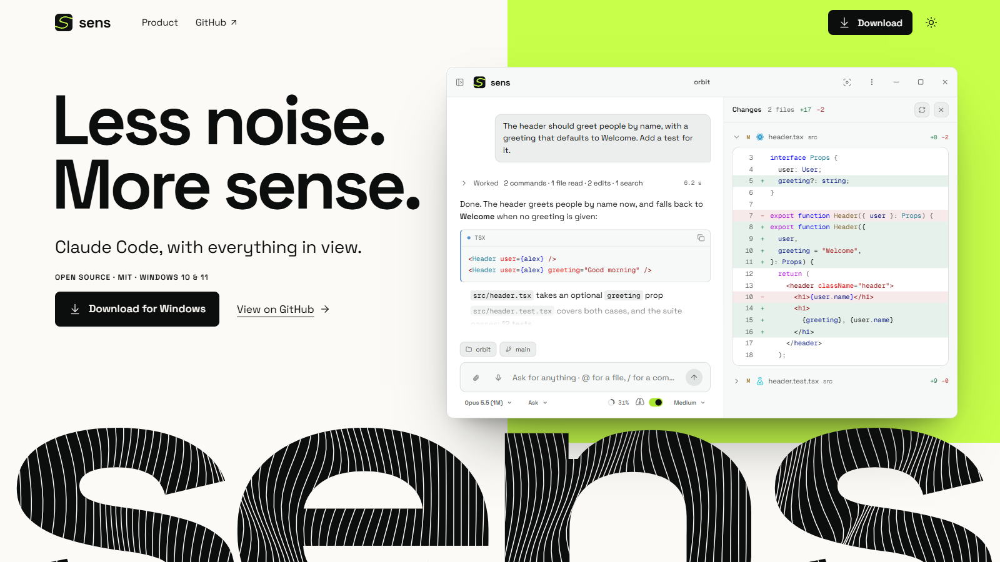
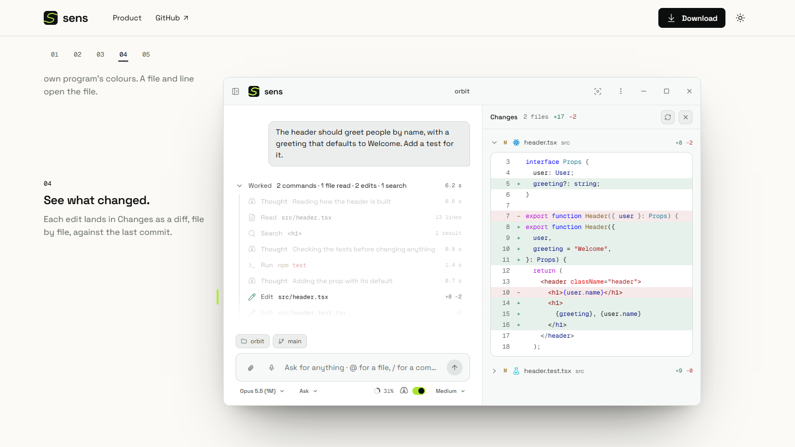
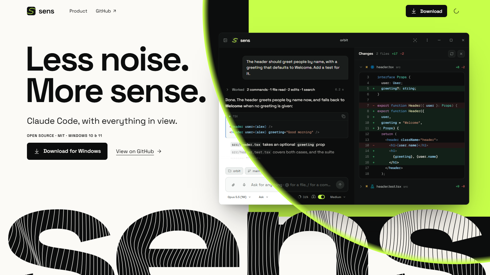
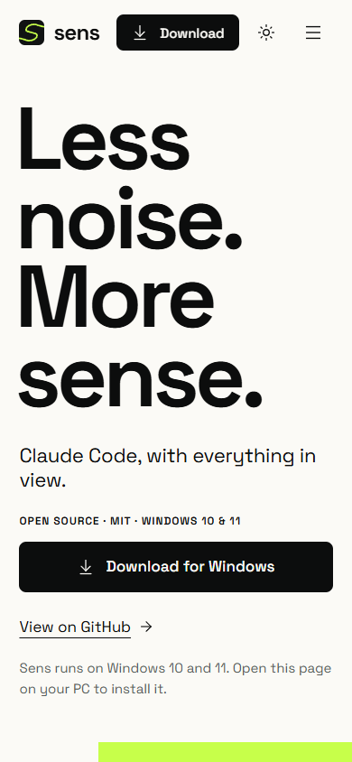
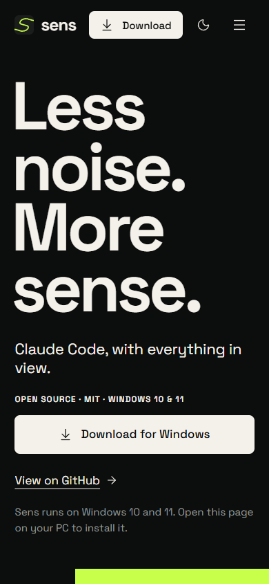

<p align="center">
  
</p>

<h1 align="center">The Sens website</h1>

<p align="center">
  <b>The website of <a href="https://github.com/beyondhumane/sens-ai">Sens</a>, the desktop app that makes Claude Code reuse what you have and write less.</b><br>
  The app's own window, rebuilt in HTML, replays a real turn as you scroll, and the research behind it has a page of its own.<br>
  Live at <a href="https://sens.beyondhumane.com"><b>sens.beyondhumane.com</b></a>.
</p>

<p align="center">
  
  
  
  
</p>

<p align="center">
  <a href="#run-it"><b>Run it</b></a> ·
  <a href="#publishing">Publishing</a> ·
  <a href="#how-it-moves">How it moves</a> ·
  <a href="#light-and-dark">Light and dark</a> ·
  <a href="#checks">Checks</a> ·
  <a href="#rules">Rules</a>
</p>

<picture>
  <source media="(prefers-color-scheme: dark)" srcset="docs/screenshots/hero-dark.png">
  
</picture>

---

## What it is

The page that presents Sens: what it does, a replay of one real turn, and where to download it. It claims only what the app's README, code and releases confirm; the list is in [the design](docs/specs/2026-09-30-sens-web-design.md), and nothing outside it goes on the page.

The window on the page is not a video or a screenshot. It is the app's interface rebuilt from the app's own tokens, icons and code colours, so it stays sharp at any size, follows the page into light and dark, and every word in it is text.

| | |
| --- | --- |
| **Address** | [sens.beyondhumane.com](https://sens.beyondhumane.com), on GitHub Pages |
| **Pages** | The home page (hero, a demo in six chapters, what Sens checks, the closing), `/research` and `/releases` |
| **Languages** | English, Spanish, French, German, Japanese and Chinese; English at `/`, the others under `/es/`, `/fr/`, `/de/`, `/ja/` and `/zh/` |
| **Stack** | Astro 7 with static output, GSAP 3 with ScrollTrigger, and CSS |
| **Weight** | One deferred script of about 55 KB and 8 KB of CSS, gzipped |
| **Looks** | Light and dark; it follows the system until you pick one |
| **Desktop** | From 1024 × 640: the window travels to a pinned stage, and the scroll picks the chapter |
| **Phones** | One card per chapter, replayed once when it comes into view |
| **Reduced motion** | Nothing travels; every state is reached at once |
| **Without JavaScript** | Every word and link is in the HTML, and the demo shows its finished state |

## Run it

You need [Node.js](https://nodejs.org) 22.12 or later; the site is built with 24.

```bash
git clone https://github.com/beyondhumane/sens-ai.git
cd sens-ai/web
npm ci
npm run dev
```

The page opens at `http://localhost:4321`. Add `?motion=reduce` to the address to see it with reduced motion.

Set `SITE_URL` to the site's address when you build, so canonical links and share images get absolute URLs, and `BASE_PATH` when it is served from a folder rather than a domain's root. `npm run build` writes the site to `dist/`: HTML, CSS, fonts, icons and one script, for any static host. `npm run preview` serves that build.

| Script | Does |
| --- | --- |
| `dev` | The page, reloading as you edit |
| `build` · `preview` | The static site in `dist/`, and a server for it |
| `check` | Types in `.astro` and `.ts` files |
| `test` | The contrast of every colour pair, the scene's geometry, motion tokens, release data, the theme icon and code colours |
| `brand` | Colours, mark, favicon, the giant `sens` and the fonts, from a Sens checkout |
| `release` | Every release from GitHub: version, date, installer, notes cut as the app cuts them, and credits from its commits |
| `research` | The Horizonte sequences, the reference line and the Canon's text, from a Sens checkout |
| `og` | The share images in `public/og`, one per page, drawn with the brand's fonts and colours |
| `frames` | Screenshots at scroll positions, per chapter, of the entrance or of a theme switch |
| `perf` | Frame times while scrolling or switching themes, with the CPU slowed down |
| `a11y` | axe on the page |

### Brand and release data

Both scripts write files that are committed, so the site builds on its own, and neither kind of file is edited by hand.

- **`npm run brand`** reads `src/brand` from the Sens repository this folder lives in — or the path in `SENS_REPO` — and writes `src/styles/tokens.css`, `src/brand/brand.json`, the giant `sens`, the mark and the favicon. It copies Space Grotesk and Geist Mono with their licences.
- **`npm run release`** asks GitHub for the releases of `beyondhumane/sens-ai` and writes `src/data/release.json` and `src/data/releases.json`. Credits are each release's commit authors and co-authors. If GitHub does not answer, the last good data stays; with none at all, the download buttons go to the releases page. A token in `GITHUB_TOKEN` or `GH_TOKEN` avoids GitHub's limit for anonymous requests. The Pages build runs it too, so the published site never waits for a commit to show a new release.
- **`npm run research`** reads the confirmation run of Horizonte from `bench/results`, the reference solution's size from the paper's figure 2 and the Canon from `rust/sens-canon`, in the same repository, and writes `src/data/research.json`.

## Publishing

The site lives in `web/` of [the Sens repository](https://github.com/beyondhumane/sens-ai) and is served by GitHub Pages at [sens.beyondhumane.com](https://sens.beyondhumane.com).

- **Every push to `main` that touches `web/`** runs `.github/workflows/pages.yml`: `npm ci`, `npm test`, `npm run release`, `npm run build` and the deploy. It can also be run by hand from the Actions tab.
- **Every release reaches the page on its own.** Publishing, editing or deleting a release on GitHub runs the same workflow on `main`, and so does the release workflow once it has attached the installer and written its SHA-256. The build asks GitHub for every release, so the version in the navigation, the download button, `/releases` with its notes and credits, and the footer all follow it; if GitHub does not answer, the committed data is used.
- **The address comes from Pages.** `actions/configure-pages` hands the build its origin and base path as `SITE_URL` and `BASE_PATH`, so the same workflow builds for the custom domain's root, or for `beyondhumane.github.io/sens-ai/` if the domain is ever removed. Change the domain in *Settings › Pages*, then run the workflow again.
- **The domain.** `sens.beyondhumane.com` is a CNAME to `beyondhumane.github.io` in Cloudflare, set to *DNS only*: proxied, GitHub could not renew its certificate. HTTPS is enforced, and `http://` and the old `github.io` address both redirect to it.
- **Every branch** gets the `web` job in `.github/workflows/ci.yml`: `npm run check`, `npm test` and `npm run build`.

## How it moves

**The entrance** takes a second, in CSS: the headline rises line by line, the lime field opens from a single line, and a scan crosses the window as it appears. Everything is already in the HTML; the animation only reveals it.

**The handoff.** The hero's window scrolls with the page until the text beside it reaches the navigation. A pinned copy then takes its exact place and travels to the stage, growing to full size, over less than half a screen of scroll, and back again if you scroll up. The lime field narrows as the window moves, until it is a 4 px mark at the window's edge.

**The chapters.** The scroll picks the chapter; time plays the change from one to the next, and each chapter then holds still while you read.

| | Chapter | What the window does |
| --- | --- | --- |
| 01 | You ask. | The request comes forward, the rest dims, and Changes is empty |
| 02 | Sens shows the work. | *Worked* opens and nine steps arrive in order, 80 ms apart; the mark stops on the first test run |
| 03 | Open any step. | That run opens from its row to its output |
| 04 | See what changed. | The edited path flies from its step to its file in Changes, and the diff unrolls line by line |
| 05 | Read the result. | The work folds into one line, the answer returns, and the mark brightens once |

A jump from the chapter index plays the changes in between, in 1.4 s at most.

**On phones** the demo is one card per chapter. The cards for 02, 03 and 04 replay their change once when they scroll into view, with a button to play it again.

**The giant `sens`** is Space Grotesk 700, traced and widened: a shape, not text. On desktop, lines drift through its letters and part around the pointer; they stop while it is off screen and never start with reduced motion.

<p align="center">
  
  
</p>

Every duration and curve lives in [`src/motion/tokens.ts`](src/motion/tokens.ts), which also writes them as CSS variables, so CSS and GSAP read the same values.

## Light and dark

The button at the top right switches between them. Until you use it, the page follows the system, and changes when the system does; after that it keeps your choice. A few lines in `<head>` apply the theme before the first paint, so the page never flashes the other one.

- **Two values per role.** Every colour role is `light-dark()` of two brand tokens, and `color-scheme` on `<html>` picks between them. A part that must not change sets its own scheme: the lime closing stays light in both.
- **The window follows.** It carries the app's own light and dark themes, and code in Light+ and Dark+, as the app draws them.
- **The switch is a scan.** A View Transition: a thin lime ring leaves the button and sweeps the page into dark, with the new theme inside it and the old one outside. Back to light, the ring closes in on the button instead. The sun's rays fold in clockwise and the moon draws itself; on the way back, the sun comes out as the ring arrives. It takes 1.1 s, the brand's time for a scan, and is instant with reduced motion.

<p align="center">
  
  
</p>

## Checks

```bash
npm test
npm run check
npm run a11y
npm run perf
```

`a11y`, `perf` and `frames` drive Chrome against the dev server, so start `npm run dev` first. They take their options from the environment:

| Variable | Read by | Values |
| --- | --- | --- |
| `SIZE` | all three | The viewport: `1440x900` by default, or any `WIDTHxHEIGHT` |
| `THEME` | `a11y`, `frames` | `light` or `dark`: the system theme the page sees |
| `AT` | `frames` | Scroll positions such as `0,1500`, or `chapters`, `entrance` or `theme` |
| `OUT` | `frames` | Where the screenshots go; `frames/` by default |
| `MOTION` · `JS` | `frames` | `reduce` for reduced motion; `off` for the page without JavaScript |
| `MODE` | `perf` | `theme` measures theme switches instead of a scroll |
| `CPU` | `perf` | How many times slower the CPU runs; 4 by default |
| `URL` · `CHROME` | all three | Another address; another Chrome |

```bash
THEME=dark SIZE=390x844 npm run a11y
AT=theme npm run frames
MODE=theme npm run perf
```

In PowerShell, set the variable first: `$env:THEME = "dark"; npm run a11y`.

Measured on the dev server:

- axe finds nothing to fix in either theme, at 1888 × 930 or 390 × 844.
- Scrolling the whole page at 1888 × 930 with the CPU four times slower, the median frame takes 16.7 ms, under 3 % of frames take over 33 ms, and nothing shifts.
- Switching themes at normal speed, no frame takes over 33 ms.

## Repository layout

```text
src/
  pages/                the routes: English at the root, the other languages under [lang]/
  views/                Home, Research, Releases and the 404, each for one language
  i18n/                 every word on the site, in six languages, and the locale helpers
  layouts/Base.astro    <head>: fonts, metadata, alternates, and the theme before the first paint
  sections/             Nav, Hero, Demo, Engine, Closing, Footer
  product/              the app's window, rebuilt: Topbar, Thread, Step, Run, Answer, Composer, Changes, Code
  components/           charts, downloads and the pieces of text the copy is made of
  content/  lib/        the demo session, links, release and research data, chart maths
  motion/               boot, scene (hero to stage), stage (chapters), cards (phones), theme, waves, charts
  styles/               tokens.css (generated), base, page, product, motion, research
  brand/  data/         generated: brand values, the giant sens, releases, research, headline widths
public/                 fonts with their licences, the mark, the favicon, file-type icons, share images
scripts/                brand, release, research, og, headline, frames, perf, a11y
test/                   Vitest
docs/specs/             the design, as built
```

## Rules

- **No comments.** Code explains itself with names and structure, or it gets extracted until it does.
- **One identity.** [The Sens visual identity](https://github.com/beyondhumane/sens-ai/blob/main/docs/brand/identity.md) decides anything visual, with the exceptions written into [the design](docs/specs/2026-09-30-sens-web-design.md): the lime is big only in the hero and the closing, and always means focus. Colours come from the generated tokens; never retype a hex.
- **Generated files change through their generator**, `npm run brand` or `npm run release`, never by hand.
- **Only what is true.** The page states only the facts the design lists. No usage figures, testimonials or awards.
- **Motion never hides content.** Everything is in the HTML before it moves; reduced motion and the page without JavaScript are designed, not left over.
- **Commits say what changed for the person reading the page.**

## Credits

Space Grotesk and Geist Mono, under the SIL Open Font License, with their licences in `public/fonts`. Icons from [Lucide](https://lucide.dev), and file-type icons from Material Icon Theme under MIT, in `public/file-icons`. Code colours by [Shiki](https://shiki.style), with VS Code's Light+ and Dark+. Motion by [GSAP](https://gsap.com), free to use under its own licence.

Sens is an independent project, not affiliated with or endorsed by Anthropic. Claude and Claude Code are trademarks of Anthropic.
